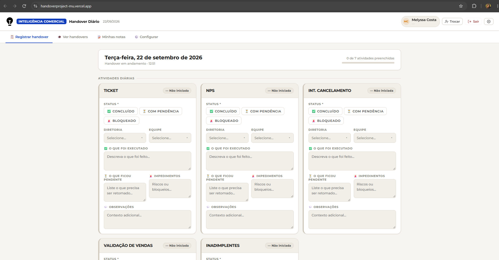
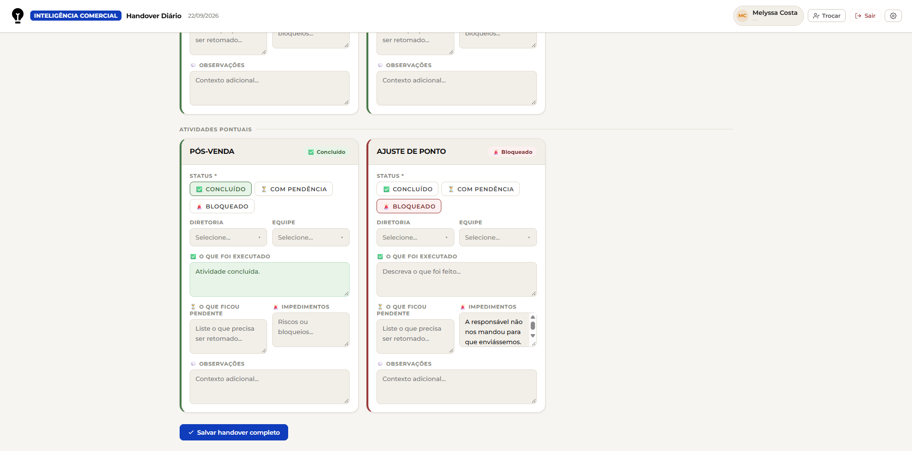
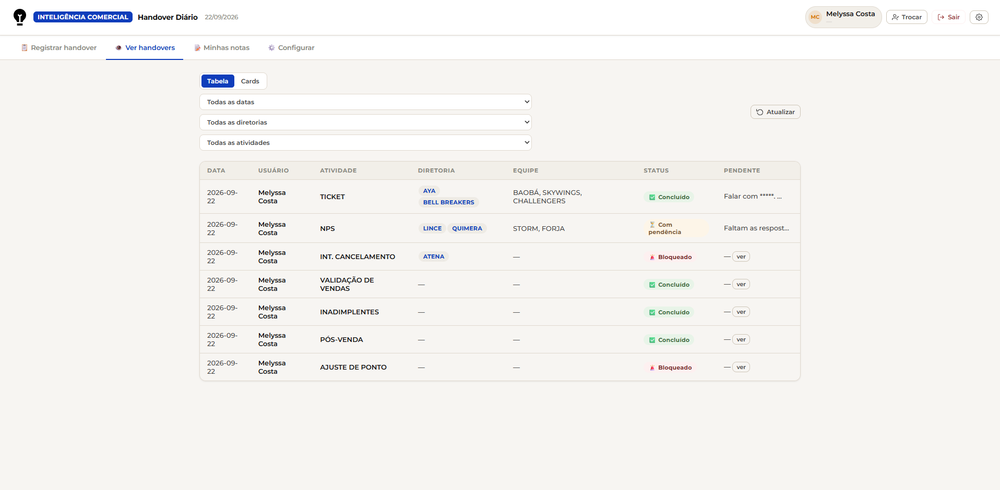
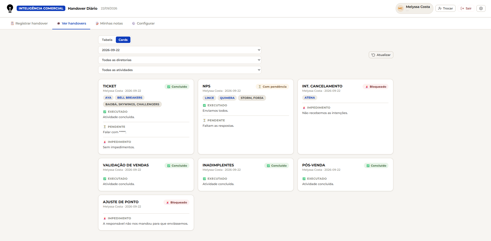
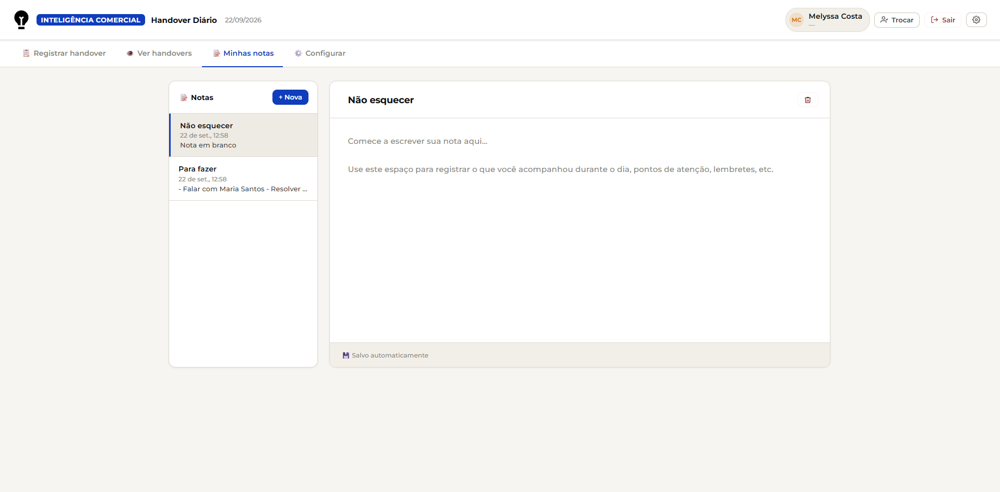
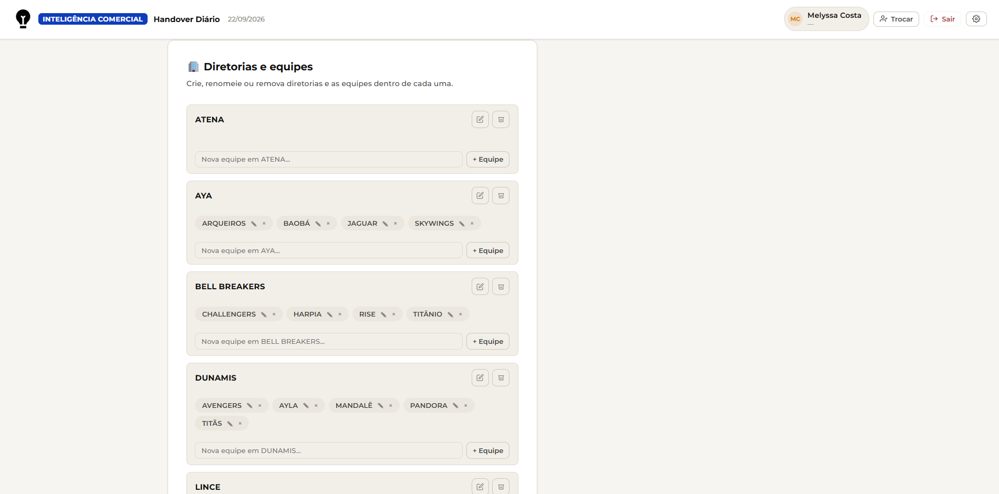

<div align="center">
<h2> 🔄 Handover Diário

Equipe GRE


<h3> Aplicação de passagem de plantão diário da equipe, reconstruída de um arquivo HTML único para uma estrutura modular, com autenticação e permissões reais.

</div>

📌 `Sobre o projeto:`

Primeiramente, a ideia do projeto partiu de mim quando tive que lidar com trocas de turnos dos assistentes e aprendizes e nisso, algumas informações se perdiam. Desse modo, com o incentivo da liderança, resolvi criar a versão piloto do projeto (na apresentação, havia apenas a versão HTML). O projeto em rendeu uma medalha e me procuraram para que fosse implementado, desse modo, surgiu a versão atual, onde me dediquei para melhorar os aspectos mencionados:

O `Handover Diário` existia como um único arquivo HTML (login com senhas fixas escritas no próprio código, sem separação entre páginas, sem controle real de quem podia editar o quê). Este projeto reconstrói a aplicação que criei do zero, mantendo a mesma ideia e o mesmo fluxo que eu inicialmente apresentei, mas sobre uma base mais estruturada: páginas separadas, autenticação de verdade e permissões por perfil de usuário.

✨ `Destaques:`
	
🔐 Autenticação real: Login por e-mail e senha via Supabase Auth, substituindo senhas fixas no código
<br>
🧩 Estrutura modular: De um HTML único para páginas, layouts, componentes e serviços separados
<br>
👥 Perfis e permissões: Regras de acesso por perfil (admin / analista) aplicadas direto no banco
<br>
💾 Autosave: Notas de plantão salvas automaticamente, sem perder o trabalho
<br>
<br>
🧩 `Estrutura do app:`
| Página | Função |
|---|---|
| Login | Autenticação por e-mail e senha |
| Handover | Registro da passagem de plantão, com cards de atividade |
| Ver | Consulta das passagens de plantão já registradas |
| Notas | Anotações rápidas com autosave |
| Config | Edição de perfil de usuário (acesso restrito a admin) |
<br>

🖼️ `Capturas de tela`
<!-- Depois de subir as imagens no repositório, troque os nomes abaixo pelos nomes reais dos arquivos -->
<div align="center">


<br><br>

<br><br>

<br><br>

<br><br>

<br><br>

<br><br>


</div>

<br>

🏗️ `Arquitetura técnica:`

Vite + JavaScript puro - sem framework, para manter o projeto leve e simples de manter
<br>
Supabase - autenticação (Supabase Auth) e banco de dados (PostgreSQL)
<br>
Vercel - hospedagem
<br>
<br>
Organização do código:
```
src/
├── pages/       → Login, Handover, Ver, Notas, Config
├── layouts/      → AppShell, LoginLayout
├── components/   → ActivityCard, MultiSelect, StatusBadge
├── services/      → authService.js (autenticação)
└── state/         → appState.js (estado compartilhado entre páginas)
```
`Banco de dados e segurança:`
<br>
O banco tem duas tabelas principais - `usuarios` e `handovers` - com Row Level Security (RLS) habilitado:
<br>
Leitura liberada para qualquer usuário autenticado
<br>
Escrita (inserir/editar/excluir) restrita ao próprio dono do registro ou a um usuário com perfil admin
<br>
Os usuários são reais (criados no Supabase Auth, com perfis `admin` e `analista`), substituindo a lista de nomes com senha fixa da versão anterior. A criação de novos logins continua feita pelo painel do Supabase, de propósito, para não expor credenciais sensíveis (`service_role`) no navegador.
<br>
<br>
`Testes:`
<br>
Build validado com `npm run build`, e o fluxo principal (login, cards de atividade, seleção diretoria → equipe, notas com autosave, edição de perfil) testado de ponta a ponta antes da entrega.
<br><br>
🛠️ Ferramentas utilizadas:
- Vite - build e desenvolvimento
- JavaScript - lógica da aplicação
- Supabase - autenticação e banco de dados (PostgreSQL)
- Vercel - deploy e hospedagem
<br><br>

<br>
<h2>👤 Sobre mim </h2>
Melyssa Costa - Analista Dados (na área de BI) na Porto Vale, com experiência prévia em BI (Power BI e Power Automate) na Pilkington Brasil.
